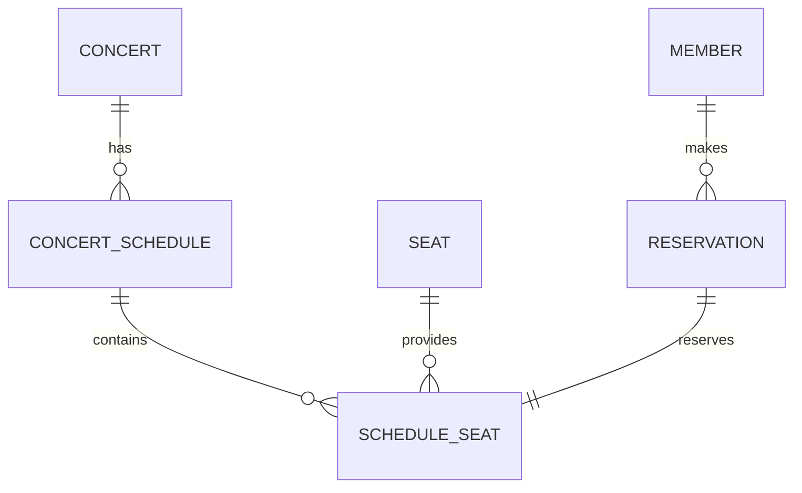

# Ticketing System 
>동일 좌석에 대한 동시 접근 상황에서 발생하는 **중복 예매 문제를 해결하는 티켓팅 시스템**

콘서트 예매 상황을 가정하여,  
사용자가 공연과 회차를 조회하고 좌석을 선택하여 예매할 수 있는 **티켓팅 시스템**입니다.

단순한 데이터 입출력을 넘어, 대규모 트래픽 환경에서 발생할 수 있는 데이터 정합성 문제와 동시성 제어를 심도 있게 다루는 것을 목표로 합니다.

---

## 1. 프로젝트 소개

기존에 진행했던 프로젝트들에서는 다양한 CRUD와 웹 서비스 흐름을 구현해보았다면,  
이번 프로젝트는 티켓팅 시스템의 핵심 문제인 **동일 좌석에 대한 동시 접근과 중복 예매 방지**를 직접 설계하고 해결하는 것을 목표로 했습니다.

공연 정보는 더미 데이터로 구성하고,  
공연 관리 기능보다는 **예매 처리의 안정성**과 **좌석 상태 관리**에 집중하여 개발하고 있습니다.

---

## 2. 개발 목표

- 공연 목록 및 상세 정보 조회
- 공연 회차별 좌석 조회
- 좌석 선택 및 예매 처리
- 좌석 선점 기능 구현
- 동일 좌석 중복 예매 방지
- Redis 기반 선점 처리
- 동시성 제어 및 부하 테스트

---

## 3. 기술 스택

### Backend
- Java 21
- Spring Boot 3.5.11
- Spring Data JPA
- Thymeleaf
- Gradle

### Database
- MySQL 8.0

### Cache / Concurrency
- Redis

### Tool
- Git / GitHub
- STS4
- MySQL Workbench

### Test
- JUnit
- JMeter or k6

---

## 4. 주요 기능

### 사용자 기능
- 회원가입
- 로그인 / 로그아웃
- 공연 목록 조회
- 공연 상세 조회
- 회차별 좌석 조회
- 예매 진행
- 예매 내역 조회
- 예매 취소

### 티켓팅 핵심 기능
- 회차별 좌석 관리
- 좌석 선점 처리
- 선점 만료 처리
- 중복 예매 방지
- 동시성 제어

---

## 5. 핵심 설계 포인트

### 1) 공연과 회차 분리
하나의 공연은 여러 회차를 가질 수 있으므로,  
`CONCERT`와 `CONCERT_SCHEDULE`을 분리하여 관리합니다.

예)
- 아이유 콘서트
  - 1회차 : 2026-05-01 19:00
  - 2회차 : 2026-05-02 19:00

### 2) 좌석과 회차별 좌석 분리
물리적인 좌석(`SEAT`)과 특정 회차의 좌석(`SCHEDULE_SEAT`)을 분리했습니다.

이유는 같은 좌석이라도 회차마다 상태가 다를 수 있기 때문입니다.

예)
- A1 좌석
  - 1회차 : 예약 완료
  - 2회차 : 예매 가능

### 3) 선점은 Redis, 최종 예약은 RDB
- **Redis** : 좌석 선점 상태와 TTL 관리
- **MySQL** : 최종 예약 정보 저장

즉,
- 선점 상태는 Redis에서 빠르게 관리
- 실제 예약 완료 여부는 DB를 기준으로 관리

### 4) 예약 대상은 `SCHEDULE_SEAT`
실제 예약 단위를 `SCHEDULE_SEAT`로 두어  
**특정 회차의 특정 좌석**을 명확하게 식별할 수 있도록 설계했습니다.

---

## 6. ERD

주요 테이블

- MEMBER
- CONCERT
- CONCERT_SCHEDULE
- SEAT
- SCHEDULE_SEAT
- RESERVATION

### 관계 요약


---

## 7. 예매 처리 흐름

1. 사용자가 공연을 선택한다.
2. 공연의 회차를 선택한다.
3. 회차별 좌석 목록을 조회한다.
4. 사용자가 좌석을 선택한다.
5. Redis에 좌석 선점 정보를 저장한다. (TTL 적용)
6. 사용자가 결제를 완료하면 예약 정보를 DB에 저장한다.
7. 예약 완료 후 Redis 선점 정보는 제거한다.

---

## 8. 동시성 제어 전략

티켓팅 시스템에서는 여러 사용자가 동시에 동일 좌석을 예매하려고 시도할 수 있습니다.  
이 문제를 해결하기 위해 다음 전략을 적용합니다.

- Redis 기반 좌석 선점 (TTL 5분)
- 동일 좌석에 대한 중복 요청 시 선점 상태 확인 후 차단
- `SCHEDULE_SEAT` 기준 Unique 제약조건으로 DB 레벨 이중 방어
- 예매 처리 시 트랜잭션을 통해 데이터 정합성 유지
- Redis를 활용하여 DB 부하를 줄이고 빠른 선점 처리를 수행 

또한, 부하 테스트 도구(k6/JMeter)를 활용하여  
동시 요청 상황에서의 실패 케이스 및 처리 성능을 검증할 예정입니다.

---

## 9. 프로젝트 구조

```text
  src/main/java/com/ticketing
   ├─ global
   │   ├─ config
   │   ├─ exception
   │   └─ util
   │
   ├─ member
   │   ├─ controller
   │   ├─ dto
   │   ├─ entity
   │   ├─ repository
   │   └─ service
   │
   ├─ concert
   │   ├─ controller
   │   ├─ dto
   │   ├─ entity
   │   ├─ repository
   │   └─ service
   │
   ├─ seat
   │   ├─ controller
   │   ├─ dto
   │   ├─ entity
   │   ├─ repository
   │   └─ service
   │
   ├─ queue
   │   ├─ controller
   │   ├─ dto
   │   └─ service
   │
   └─ reservation
       ├─ controller
       ├─ dto
       ├─ entity
       ├─ repository
       └─ service

```
## 10. Redis Key Design

| Key Pattern | Type | Description | TTL |
|---|---|---|---|
| active:round:{scheduleNo} | Set | 현재 좌석 페이지 접근이 허용된 사
용자 목록 | 없음 |
| wait:round:{scheduleNo} | Sorted Set | 회차별 대기열 사용자 목록 |
없음 |
| seat:hold:{scheduleNo}:{seatNo} | String | 특정 좌석을 선점한 사용자
loginId | 5분 |
| RT:{loginId} | String | 사용자 Refresh Token | 토큰 만료 시간 기준 |

## 11. Redis Usage

이 프로젝트에서는 Redis를 다음 목적으로 사용한다.

- 대기열 관리
    - 회차별 활성 사용자(active:round:{scheduleNo})와 대기 사용자
      (wait:round:{scheduleNo})를 관리한다.
    - Lua 스크립트를 사용해 대기열 진입 및 승격 로직을 원자적으로 처리
      한다.
- 좌석 선점 관리
    - seat:hold:{scheduleNo}:{seatNo} 키를 사용해 특정 좌석의 선점 상
      태를 저장한다.
    - 선점 정보는 5분 TTL을 가지며, 예약 완료 또는 페이지 이탈 시 삭제
      된다.
- 인증 관리
    - RT:{loginId} 키를 사용해 사용자 Refresh Token을 저장한다.

## 12. 진행 현황

- [x] 프로젝트 초기 세팅 및 ERD 설계
- [x] 공연/회차/좌석 조회 API 구현
- [x] Spring Security + JWT 기반 인증 시스템
- [x] Redis 기반 좌석 선점 로직 구현 (TTL 5분 적용)
- [x] Redis Sorted Set 기반 대기열 시스템 구현
- [x] Lua Script를 활용한 대기열 진입/승격 원자성 보장
- [x] 동시성 제어 및 데이터 정합성 검증 (1차 완료)
- [ ] 예매 취소 및 좌석 환원 로직
- [ ] k6/JMeter를 활용한 고부하 상황 성능 측정 및 최적화
- [ ] Redis Key 조회 구조 개선 및 선점 조회 성능 최적화
