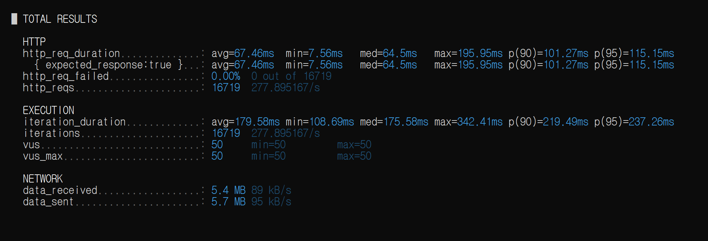
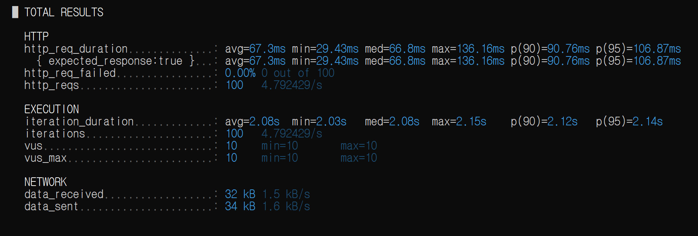
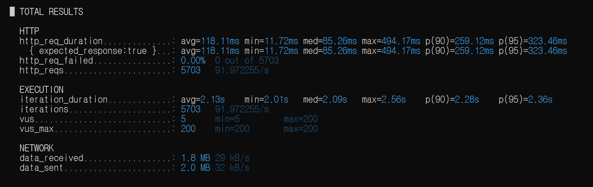
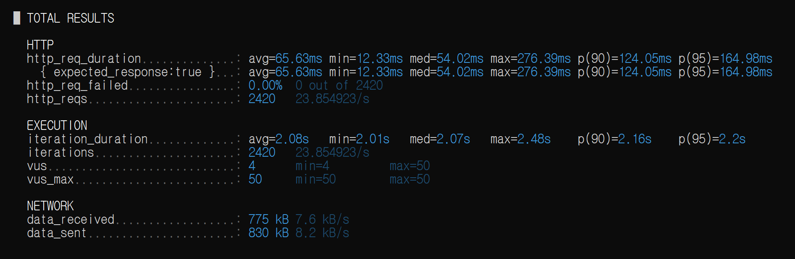

# 🚀 부하 테스트 리포트: 대기열 상태 조회 API

## 1. 개요
- **테스트 일시:** 2026-04-24
- **대상 API:** `GET /api/queue/1/status`
- **테스트 목적:** 부하 강도(동시 접속자 수 및 요청 빈도) 변화에 따른 서버의 응답 성능 및 자원 점유율(CPU) 분석

## 2. 테스트 환경
- **Server:** Localhost (Spring Boot 3.x, Java 17)
- **Database:** Redis (대기열 관리용)
- **Tool:** k6 v0.51.0
- **Monitoring:** Windows 작업 관리자 (CPU 점유율 체크)

## 3. 테스트 시나리오 및 결과 요약

| 테스트 단계 | 설정 (VUs / Duration / Sleep) | 총 요청수 | TPS | p95 응답 | 최대 CPU | 결과 및 분석 |
| :--- | :--- | :--- | :--- | :--- | :--- | :--- |
| **1. 기초(Baseline)** | 10 VUs / 20s / 2s | 100 | 4.79/s | 106.87ms | 미측정 | 시스템 정상 작동 확인 |
| **2. 부하 확장** | 50 VUs / 100s / 2s | 2,420 | 23.85/s | 164.98ms | 미측정 | 안정적인 선형 성능 유지 |
| **3. 스트레스 A (VUs)** | 200 VUs / 60s / 2s | 5,703 | 91.9/s | **323.46ms** | **34%** | 동시 접속자 증가 시 지연 발생 |
| **4. 스트레스 B (TPS)** | 50 VUs / 60s / **0.1s** | **16,719** | **277.8/s** | 115.15ms | **42%** | 고밀도 요청에 최적화된 성능 |

---

## 4. 상세 분석 및 인사이트

### 4.1. 동시 접속자 수(VUs)와 지연 시간의 관계
- **시나리오 A (200 VUs)** 테스트 결과, 요청 횟수 자체보다 **'동시 유지 커넥션'**이 늘어날 때 응답 속도(`p95`)가 기초 대비 약 3배(323ms) 증가함.
- 이는 서버의 스레드 풀 관리 및 컨텍스트 스위칭 비용이 응답 지연의 주요 원인이 될 수 있음을 시사함.

### 4.2. 처리량(TPS) 한계 및 CPU 효율성
- **시나리오 B (sleep 0.1s)**에서 초당 약 280건의 요청을 처리하면서도 CPU 점유율은 42% 수준으로 유지됨.
- Redis 기반의 대기열 조회 로직이 매우 효율적으로 설계되어 있으며, 현재 테스트는 Redis     
  기반 조회 API에 대한 성능이며,
  실제 예매 API(쓰기 + 동시성 제어)가 포함될 경우 성능은 크게 달라질 수 있다.
### 4.3. 자원 모니터링 결과
- 테스트 중 CPU 사용량이 50%를 넘지 않았으며, 메모리 누수나 에러(`http_req_failed: 0.00%`) 없이 모든 테스트가 완료됨.
- 시스템의 물리적 임계점(Breaking Point)은 아직 도달하지 않았으며, 네트워크 I/O나 스레드 설정이 다음 병목 지점이 될 것으로 예상됨.

---

## 5. 결론 및 향후 계획
- **결론:** 본 API는 동시 접속 200명, 초당 요청 280건 상황에서도 0.5초 이내의 응답을 보장하는 높은 신뢰성을 보임.
- **향후 계획:**
    1. **RDB 연동 테스트:** 단순 Redis 조회가 아닌, 실제 티켓 예매(RDB 쓰기)가 포함된 API의 스트레스 테스트 진행 예정.
    2. **임계점 돌파:** CPU 점유율을 80% 이상으로 끌어올리기 위해 500 VUs 이상의 초고강도 테스트 시도 예정.

---

## 6. 관련 로그 (스크린샷 대조용)
- 
- 
- 
- 
